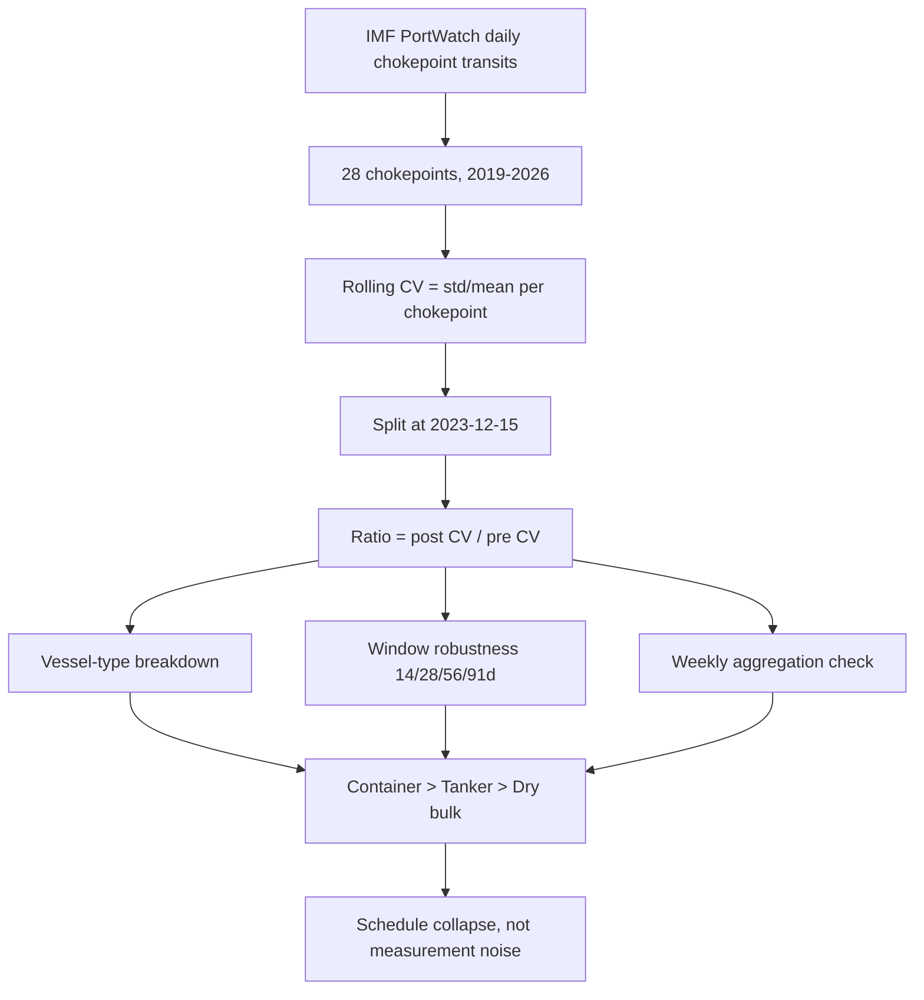

# 🚢 Chokepoint Variance — What the Red Sea Closure Actually Cost


**Everyone measured the Red Sea disruption in extra days. The real damage was to schedule *reliability* — and it landed on the route ships abandoned, not the one they moved to.**

---

## 🎯 Headline Result

In December 2023, major carriers suspended Red Sea transits and rerouted Asia–Europe
traffic around the Cape of Good Hope. Transit volumes are the obvious story. This
project measures something else: **how erratic the flow became**, using the
coefficient of variation (rolling σ / rolling μ) of daily transit counts.

| Chokepoint | Role | Container CV ratio | Direction |
|---|---|---|---|
| **Bab el-Mandeb** | abandoned route | **1.81** (2.76 weekly) | 🔴 far less predictable |
| **Suez Canal** | abandoned route | **1.40** (1.59 weekly) | 🔴 less predictable |
| **Cape of Good Hope** | the reroute | **0.77** (0.94 weekly) | 🟢 *more* predictable |
| **Panama Canal** | unrelated disruption | 0.95 | ⚪ no container effect |
| **Malacca Strait** | control | 0.85 | ⚪ no effect |

> CV ratio = mean post-event CV ÷ mean pre-event CV. Above 1 = more erratic.

**The Cape absorbed a near-quadrupling of container traffic and became *more*
regular while doing it.** That is the counterintuitive part, and it is not what
the coverage reported.

---

## 🔬 The Discriminating Test

If this were measurement noise — AIS spoofing, dark vessels, transponders off in a
conflict zone — it would hit every vessel type equally. It doesn't.

| Chokepoint | 📦 Container | 🛢️ Tanker | ⛏️ Dry bulk |
|---|---|---|---|
| Bab el-Mandeb | **1.81** | 1.29 | 1.18 |
| Suez Canal | **1.40** | 1.07 | 0.99 |
| Cape of Good Hope | 0.77 | 0.85 | 0.84 |
| Panama Canal | 0.95 | 1.04 | **1.31** |
| Malacca Strait | 0.85 | 0.86 | 0.91 |

Two things fall out of this table.

**The gradient follows scheduling.** Container lines run fixed weekly rotations.
Tankers move on spot charters. Dry bulk sits between. The CV response orders itself
the same way — container > tanker > dry bulk — at *both* disrupted chokepoints.

**Panama shows the opposite signature.** Its 2023–24 disruption was drought-driven
draft restrictions and transit slot auctions, which bite bulk carriers, not liner
services. Container 0.95, dry bulk 1.31. A contemporaneous disruption with a
different mechanism produces a different fingerprint — which rules out "any
disruption raises variance everywhere."

---

## 📉 What Happened to Volume

```
Suez Canal          75 → 42 transits/day      ▼ 44%
Bab el-Mandeb       78 → 40 transits/day      ▼ 49%
Cape of Good Hope   50 → 95 transits/day      ▲ 90%
Malacca Strait     183 → 227 transits/day     ▬ flat (upstream of the split)
```

Malacca sits upstream of the Suez/Cape decision point on the Asia–Europe route.
It didn't move. **Trade rerouted; it did not disappear.**

---

## 🧪 Robustness

The container effect at Bab el-Mandeb is not an artifact of window length:

| Rolling window | 14d | 28d | 56d | 91d |
|---|---|---|---|---|
| CV ratio | 1.810 | 1.808 | 1.831 | 1.860 |

And it **strengthens** under weekly aggregation (2.76), where counts are ~40/week
rather than ~6/day. That matters: if the effect were Poisson noise from thin daily
counts, aggregating up would dampen it. It does the opposite — meaning the swing is
week-to-week, not day-to-day jitter. Consistent with convoy timing and carrier
suspend/resume decisions rather than arrival noise.

Against all 28 chokepoints, Bab el-Mandeb's total-transit CV ratio (1.435) ranks
**3rd of 28** (mean 1.117, median 1.033, σ 0.250). The two above it — Kerch Strait
(1.99) and Strait of Hormuz (1.66) — are both conflict-affected, which is
informative rather than reassuring. See limitations.

---

## 🗺️ Method



**Event date:** 2023-12-15, when major carriers publicly announced Red Sea
suspension. The first vessel seizure was 2023-11-19; the later date is used because
it marks the fleet-wide operational decision rather than the triggering incident.
Results are not sensitive to which is chosen.

**Controls:** Malacca Strait (same trade lane, upstream of the reroute decision) and
Panama Canal (contemporaneous disruption, different mechanism, no conflict).

---

## ⚠️ Limitations

Stated plainly, because they are the first things a careful reader will raise.

**AIS data quality in conflict zones.** PortWatch documents GPS jamming, AIS
spoofing, and vessels going dark in the Red Sea and around Hormuz. Degraded
reporting would inflate measured variance without any change in real shipping
behaviour. The vessel-type gradient argues against this — spoofing does not
distinguish a boxship from a tanker — but it does not eliminate it.

**Small post-period counts.** Bab el-Mandeb container transits fell from 17.1 to
5.9 per day. CV on counts that low is unstable. The weekly-aggregation check
(counts ~40) is the response to this, and the effect survives it, but the daily
figure should be read with that in mind.

**Malacca has a known break.** PortWatch expanded receiver coverage in 2021, causing
a documented step change in recorded Malacca calls. It is used here as a qualitative
confirmation that trade rerouted, not as a quantitative control.

**These are descriptive statistics, not inference.** Ratios of means, no standard
errors, no significance test. A permutation test over the 28-chokepoint null is the
next step. Until then, "1.81" is an estimate without a confidence interval.

**Publisher restates history.** PortWatch revises past data when methodology changes
— vessel classification expanded from 2 to 5 categories in 2024 (backfilled),
boundaries refined, AIS spoofing checks added in 2026. Reproducing these numbers
requires the same data vintage.

---

## 📦 Data

**Source:** [IMF PortWatch](https://portwatch.imf.org) — Daily Chokepoint Transit
Calls and Trade Volume Estimates. Satellite AIS on ~90,000 vessels.

| | |
|---|---|
| Chokepoints | 28 |
| Rows | 77,784 |
| Range | 2019-01-01 → 2026-08-09 |
| Grain | one row per chokepoint per day |
| Vessel types | container, dry bulk, general cargo, ro-ro, tanker |
| Retrieved | 2026-08-18 (data vintage 2026-08-11) |

Raw data is gitignored. Download it from the link above into `raw/`.

---

## 🚀 Running It

```bash
python -m venv .venv
.venv\Scripts\activate          # Windows
pip install pandas matplotlib

python scripts/explore.py           # schema, date range, integrity check
python scripts/plot_chokepoints.py  # transit volumes, 4 chokepoints
python scripts/plot_cv.py           # rolling CV, 4 chokepoints
python scripts/cv_all.py            # vessel-type CV ratios
python scripts/cv_robust.py         # window + weekly aggregation checks
```

Outputs land in `outputs/figures/` and `outputs/tables/`.

---

## 🧭 Next

- [ ] Permutation test over the 28-chokepoint null → p-value for the container effect
- [ ] Port-level analysis: did arrival clustering propagate into European port congestion?
- [ ] Ever Given (March 2021) as a method validation — a disruption with a known answer
- [ ] Separate the AIS-degradation hypothesis using capacity vs count divergence