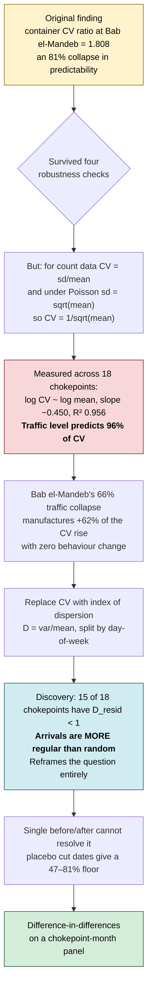
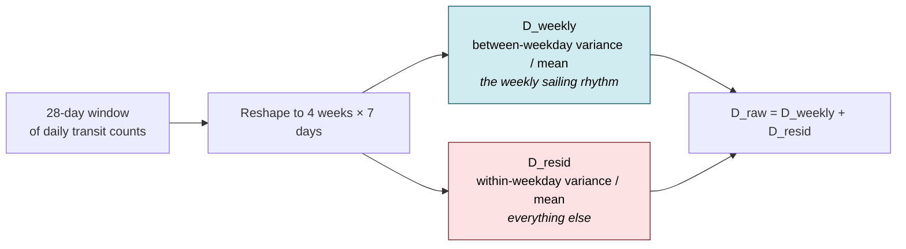
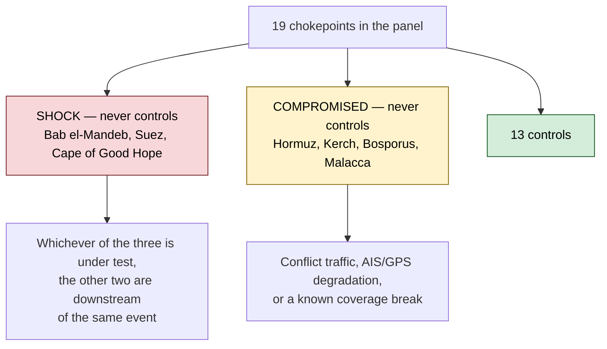
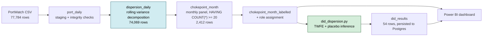

# Chokepoint Variance

**Did the Red Sea disruption make shipping flows less predictable — and can that be measured?**

When carriers suspended Bab el-Mandeb transits in December 2023, traffic collapsed and re-routed around the Cape of Good Hope. This project asks a narrower question than "how much traffic moved": it asks whether the *rhythm* of arrivals changed, and it spends most of its effort on whether that question can be answered at all with daily transit counts.

The short answer: yes, but only after discarding the first estimator, which turned out to measure traffic volume rather than predictability.

---

## Contents

- [The finding](#the-finding)
- [How the analysis changed course](#how-the-analysis-changed-course)
- [Why the first estimator was wrong](#why-the-first-estimator-was-wrong)
- [The replacement estimator](#the-replacement-estimator)
- [Why a before/after comparison cannot work here](#why-a-beforeafter-comparison-cannot-work-here)
- [Difference-in-differences](#difference-in-differences)
- [Results](#results)
- [What is ruled out](#what-is-ruled-out)
- [Limits](#limits)
- [Data and pipeline](#data-and-pipeline)
- [Running it](#running-it)

---

## The finding

**The Cape of Good Hope — the route that *absorbed* the diverted traffic — lost its weekly sailing rhythm and had not recovered it by mid-2026.**

That is the headline because it is the best-identified result in the project and the hardest to explain away. Cape *gained* container traffic over the period (5.9 → 18.8 transits per day between 2023 and 2024), so no thin-data or small-sample story reaches it. Its pre-trend is indistinguishable from zero at two independent placebo cut dates. And the effect appears in `D_weekly`, the component of dispersion that carries no traffic loading at all (the coefficient on `log n` is +0.002 — effectively nothing).

**Bab el-Mandeb — the abandoned route — shows the opposite signature.** Its within-week regularity collapsed (`D_resid` +81%, z +7.13) while its weekly calendar was untouched (`D_weekly` −4.5%, z −0.19, rank 12 of 14). Ships kept coming on the same days of the week; *which* day any given ship arrived became close to a coin flip.

That `D_weekly` null at Bab was a **failed prediction**. The expectation going in was that a route abandoned by scheduled liner services would lose its weekly calendar first. It did not. It is reported here with the same prominence as the positive results.


---

## How the analysis changed course



The error is left in the repository rather than quietly removed. `scripts/cv_robust.py` still runs the four robustness checks the original finding passed, and `scripts/confound_check.py` is kept as superseded. Catching the mistake is a substantial part of what this project demonstrates.

---

## Why the first estimator was wrong

The coefficient of variation looks like a natural measure of unpredictability: standard deviation scaled by the mean, dimensionless, comparable across routes of different size.

For count data it is not. If arrivals were Poisson, then sd = √mean, so:

$$\mathrm{CV} = \frac{\sqrt{\mu}}{\mu} = \frac{1}{\sqrt{\mu}}$$

CV becomes a deterministic function of the traffic level. A route that loses two-thirds of its traffic will show a large CV rise even if every remaining ship arrives exactly as predictably as before.

This is not a theoretical worry. Regressing log CV on log mean across the 18 usable chokepoints gives a slope of **−0.450** with **R² = 0.956** — close to the theoretical −0.5, and enough to account for most of the original finding. Bab el-Mandeb's 66% traffic collapse alone manufactures roughly +62% of the observed CV increase.

An earlier check (`confound_check.py`) caught the direction of this problem but was circular: Bab el-Mandeb carried about 0.8 leverage in that regression and was largely fitting the line to itself. It is kept in the repository, marked superseded.

---

## The replacement estimator

The index of dispersion, computed on 28-day rolling windows and decomposed by day of week:



Splitting the variance this way separates two different kinds of unpredictability:

| Component | Question it answers |
|---|---|
| `D_weekly` | Does traffic still follow a weekly calendar? |
| `D_resid` | Given the day of week, is the count predictable? |
| `D_raw` | Total dispersion (the sum) |

The implementation was validated against synthetic data with known answers: on simulated Poisson arrivals the measured CV–mean slope is −0.498 against a theoretical −0.5.

### The reframing this produced

**15 of 18 chokepoints have `D_resid` < 1.** Under a Poisson process the index of dispersion equals 1 by construction. Values below 1 mean shipping arrivals are *more regular than random* — which is what scheduled liner services should produce, and which invalidates any chi-square noise bound built on a Poisson assumption.

This changed the question. It is not "did variance rise above noise" but "did the route lose the regularity it had".

---

## Why a before/after comparison cannot work here

Comparing dispersion before and after December 2023 at a single chokepoint produces one number from two numbers. To find out what that comparison can resolve, `noise_floor.py` reassigns the cut date to arbitrary dates where nothing happened.

**Placebo cut dates produce apparent effects of 47–81%** — the same magnitude as the largest effect this project ever claimed. A single before/after split cannot distinguish the Red Sea disruption from an arbitrary date on the calendar.

Restricting the window to 2022 onward *widened* the floors for `D_raw` and `D_resid` (stationary sampling noise, which no design fixes) but *narrowed* the floor for `D_weekly` — a common structural component that time fixed effects can absorb. That asymmetry is what justified moving to a panel design, and it is why `D_weekly` is the pre-registered primary estimator rather than a post-hoc choice.

---

## Difference-in-differences

$$\log D_{it} = \alpha_i + \gamma_t + \beta\,\mathrm{Treated}_{it} + \delta \log n_{it} + \varepsilon_{it}$$

| Term | Role |
|---|---|
| $\alpha_i$ | Chokepoint fixed effects — absorb permanent level differences |
| $\gamma_t$ | Month fixed effects — absorb shocks common to all routes (COVID, the 2021 container crunch, demand swings) |
| $\beta$ | The estimate — differential move at the treated chokepoint |
| $\delta \log n$ | Traffic level as a covariate, so the mean-bias correction is estimated *within* chokepoint alongside $\beta$ |

Two-way fixed effects are applied by within-transformation (Frisch–Waugh) rather than dummy variables.

### Inference

With 13 controls, conventional t-statistics would be dishonest — the chokepoints are not independent draws, since overlapping trade lanes mean the effective sample is smaller still. Instead, treatment is reassigned to each control chokepoint in turn and the real $\beta$ is read against that placebo distribution.

**The p-value floor is 1/(n+1) = 0.071.** Only z-scores and ranks are reported. Inference here is descriptive.

### The control set



An earlier version excluded only the *other* two shock routes relative to the default treated unit, which left Bab el-Mandeb inside the control group when Cape or Hormuz was under test. Correcting this halved Cape's `D_resid` estimate (+0.641 → +0.282) and moved Hormuz's `D_resid` from indistinguishable to distinguishable (z +0.81 → +2.33). Bab's own estimates were unaffected.

---

## Results

Panel: **1,023 chokepoint-months**, 19 chokepoints, 2022-01 to 2026-07, 13 controls per test.


### Cape of Good Hope — the absorbing route

| Estimator | β | Δ in D | z | rank | δ (log n) | pre-trend (−12mo) |
|---|---|---|---|---|---|---|
| **`D_weekly`** (primary) | **+0.532** | **+70.2%** | **+2.47** | **1 of 14** | +0.002 | +0.023 (rank 13 of 14) |
| `D_resid` | +0.282 | +32.6% | +3.38 | 1 of 14 | +0.274 | +0.172 (rank 8 of 14) |
| `D_raw` | +0.326 | +38.6% | +3.23 | 1 of 14 | +0.224 | +0.116 (rank 9 of 14) |

Annual path (`D_weekly`): 2023 (post) +0.23 · 2024 +0.64 · 2025 +0.57 · 2026 +0.69

**Reading.** The absorbing route never established a weekly rhythm for the volume it inherited, and had not by 2026. The effect grows into 2024 and holds. Two features make this the strongest result:

- **No traffic loading.** `δ = +0.002` on `D_weekly` means the estimate is not being carried by the traffic surge. The mechanical mean-bias story does not reach this estimator.
- **No detectable pre-trend at two lags.** +0.023 at −12 months (rank 13 of 14) and −0.029 at −6 months (rank 14 of 14). At both cuts, almost every control shows a *larger* absolute pre-trend than Cape does.

`D_resid` and `D_raw` do load on traffic (δ = +0.274 and +0.224), which is expected — those contain the Poisson-like component that mechanically tracks the mean. They are sensitivity checks, not the headline.

### Bab el-Mandeb Strait — the abandoned route

| Estimator | β | Δ in D | z | rank | δ (log n) | pre-trend (−12mo) |
|---|---|---|---|---|---|---|
| `D_resid` | +0.595 | +81.2% | +7.13 | 1 of 14 | +0.265 | +0.116 (rank 8 of 14) |
| `D_raw` | +0.455 | +57.6% | +4.50 | 1 of 14 | +0.206 | +0.102 (rank 9 of 14) |
| **`D_weekly`** | **−0.046** | **−4.5%** | **−0.19** | **12 of 14** | −0.073 | +0.147 (rank 7 of 14) |

Annual path (`D_resid`): 2023 (post) +0.97 · 2024 +0.35 · 2025 +0.58 · 2026 +0.46

**Reading.** Within-week regularity was lost — `D_resid` rose from about 0.58 toward 1.05, meaning arrivals became roughly as unpredictable as a Poisson process, having previously been considerably more regular than one. The weekly calendar itself did not move.

**The `D_weekly` null is a failed prediction and is reported as one.** The expectation was that schedule breakdown would appear there first. It did not. Rank 12 of 14 means eleven control chokepoints show a larger absolute effect than the treated route does.

### Strait of Hormuz — the AIS-degradation confound test

| Estimator | β | Δ in D | z | rank | δ (log n) | pre-trend (−12mo) |
|---|---|---|---|---|---|---|
| `D_resid` | +0.196 | +21.6% | +2.33 | 1 of 14 | +0.106 | +0.179 (rank 8 of 14) |
| `D_raw` | +0.172 | +18.7% | +1.70 | 3 of 14 | +0.038 | +0.152 (rank 7 of 14) |
| `D_weekly` | +0.066 | +6.8% | +0.33 | 11 of 14 | −0.225 | +0.159 (rank 7 of 14) |

Annual path (`D_resid`): 2023 (post) −0.30 · 2024 +0.04 · 2025 +0.16 · **2026 +1.02**

**Reading.** GPS jamming is documented at Hormuz across the entire study window. If AIS degradation were producing the Bab el-Mandeb signature, Hormuz should show it too, at the same time. It does not.

Hormuz's pooled `D_resid` **is** distinguishable from placebo (z +2.33) — this must not be described as "flat". But its annual path has no step at December 2023: it is negative through 2023, near zero in 2024, and only reaches +1.02 in 2026, where it exceeds Bab el-Mandeb's pooled effect. Something is happening at Hormuz; it is not the Red Sea shock, and it is **not explained by this project**. Regional tension is a plausible but untested guess.

The correct phrasing is: *Hormuz does not show the Bab el-Mandeb signature at the Bab el-Mandeb time.*

---

## What is ruled out

| Alternative explanation | How it was addressed |
|---|---|
| Small-sample / thin-data artifact | Estimator design (D is not mean-dependent the way CV is); Cape *gained* traffic and still shows the effect |
| Common shocks (COVID, demand cycles) | Month fixed effects |
| Pre-existing divergence | −12mo and −6mo placebo cuts, each against its own null distribution |
| AIS / GPS degradation | Hormuz as a confound test — no step at the event date |
| Mean bias from traffic level | `log n` as a within-chokepoint covariate; the primary estimator carries δ ≈ 0 |
| Estimator bug | SQL and Python implemented independently and validated to 1.5e-14 |

---

## Limits

**Parallel trends is assumed, not demonstrated.** The pre-trend placebo has its own null distribution, and that null is wide: sd 0.240 for `D_resid` at a −12-month lag, 0.392 at −6 months. The test is unbiased (its null is centred on zero) but underpowered — **it cannot detect a pre-trend smaller than roughly ±0.5 in log D**, which is larger than most of the effects estimated here. A small pre-trend coefficient is consistent with no pre-trend; it is not proof of one.

For the same reason, no "net of pre-trend" figure is reported. Subtracting a quantity whose null sd is 0.240 from a β of 0.282 produces a number that flips sign with the choice of lag (+0.110 at −12 months, −0.100 at −6 months). It would look like a result and would not be one.

**Inference is descriptive.** 13 controls, p-floor 0.071, and the chokepoints are not independent draws — overlapping trade lanes mean the effective n is below 13.

**The vessel-type gradient is not established.** An earlier CV-based split (container 1.81 > tanker 1.29 > dry bulk 1.18) was never adjusted for differential sample-size loss and is **not cited as a finding**.

**Hormuz's 2026 climb is unexplained.** It reaches +1.02, larger than Bab el-Mandeb's pooled effect, and this project does not account for it.

**Raw dispersion and β answer different questions.** Cape's raw monthly `d_resid` reaches 7.15 in August 2024 — nine months above 2.0 across 2024–2026, all full months with normal traffic. β is a *differential* move conditional on time effects and traffic; it is not a before/after ratio and should not be compared to one.

**Analysis is container transits only** (`n_container`). Traffic figures quoted here refer to that series.

---

## Data and pipeline

**Source.** [IMF PortWatch](https://portwatch.imf.org) — Daily Chokepoint Transit Calls. 28 chokepoints, 77,784 rows, 2019-01-01 to 2026-08-09. Retrieved 2026-08-18 (vintage 2026-08-11). The raw CSV is gitignored; re-download into `raw/`.



The SQL layer exists for cross-validation, not scale. Its value was demonstrated concretely: running the DiD from Postgres gave β = +0.595 where the CSV path gave +0.674. The SQL panel view applied `HAVING COUNT(*) >= 20`; the Python `build_panel()` had no equivalent, so it included a month built from 9 days and weighted it equally with full months. **The SQL was right.** Both paths now agree, and this was the only one of three self-caught errors in the project found because two independent implementations disagreed.

### Files

| Path | Purpose |
|---|---|
| `sql/01_schema.sql` | `port_daily` table |
| `sql/02_load.sql` | Staging, `\copy`, integrity checks |
| `sql/03_dispersion_view.sql` | Rolling dispersion via variance decomposition — validated against Python to 1.5e-14 |
| `sql/04_panel_view.sql` | Monthly panel + labelled view |
| `sql/05_powerbi_views.sql` | Presentation views for Power BI |
| `scripts/validate_dispersion.py` | Estimator validation on synthetic data, pre-period only |
| `scripts/noise_floor.py` | Placebo noise floor for single before/after |
| `scripts/did_dispersion.py` | **The main result.** `--db` reads Postgres, `--treated` selects the unit |
| `scripts/export_did_results.py` | Runs the full grid, persists to `did_results` |
| `scripts/cv_robust.py` | The original CV finding and the four checks it passed |
| `scripts/confound_check.py` | Superseded (circular, leverage ≈ 0.8) — kept |
| `scripts/rank_test.py` | Superseded (p floored) — kept |

---

## Running it

```bash
# 1. Download the PortWatch CSV into raw/

# 2. Build the database
psql -U postgres -d shipping_variance -f sql/01_schema.sql
psql -U postgres -d shipping_variance -f sql/02_load.sql
psql -U postgres -d shipping_variance -f sql/03_dispersion_view.sql
psql -U postgres -d shipping_variance -f sql/04_panel_view.sql
psql -U postgres -d shipping_variance -f sql/05_powerbi_views.sql

# 3. Validate the estimator against synthetic data
python scripts/validate_dispersion.py

# 4. Establish what a single before/after can resolve
python scripts/noise_floor.py

# 5. The main result
python scripts/did_dispersion.py --db
python scripts/did_dispersion.py --db --treated "Cape of Good Hope"
python scripts/did_dispersion.py --db --treated "Strait of Hormuz"

# 6. Persist the full grid for the dashboard
python scripts/export_did_results.py --db
```

Outputs land in `outputs/tables/`. Estimates are written to the Postgres table `did_results` and to `outputs/tables/did_results.csv`.

**Note.** `dispersion_daily` and `chokepoint_month` are materialized views. If `port_daily` is reloaded, run `REFRESH MATERIALIZED VIEW` on both or the dashboard will show stale numbers while `did_results` shows fresh ones.

The Power BI file is not committed (Import mode would embed a snapshot of the gitignored source data). To rebuild: connect to `localhost` / `shipping_variance` in Import mode, load `chokepoint_month_pbi`, `dispersion_daily_v` and `did_results`, and set every dispersion measure to **Average** — Power BI defaults to Sum, and a summed dispersion index is meaningless.